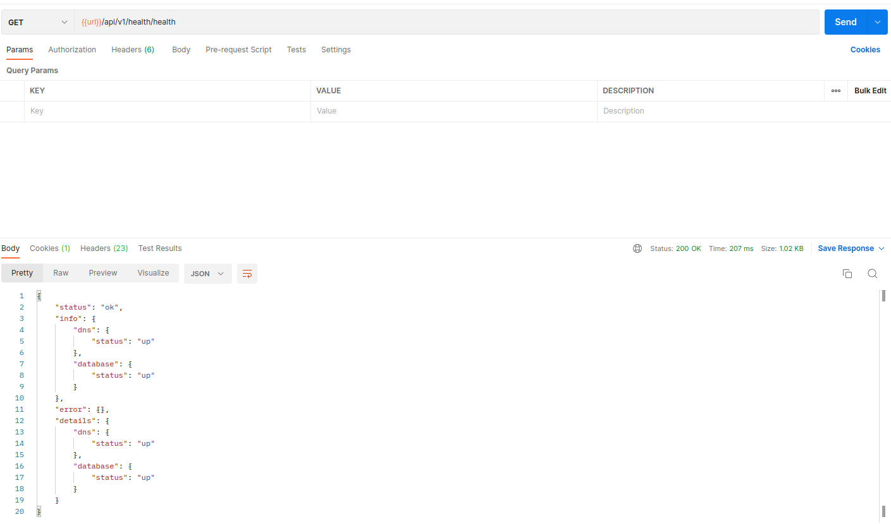
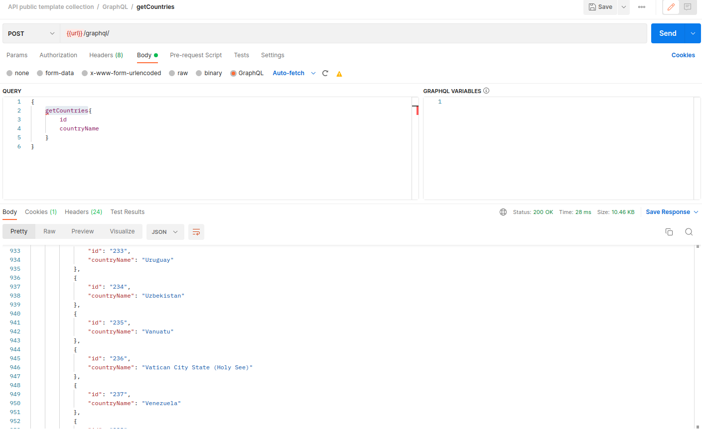
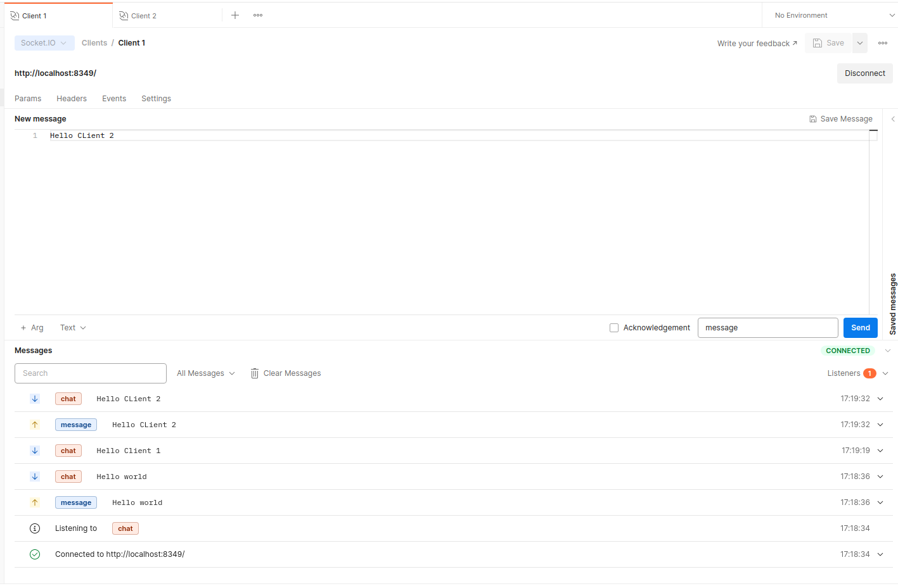

# Guide

- How fe call to server:

  - [Rest APIs](#rest-apis)
  - [GraphQL](#GraphQL)
  - [Socket.io](#socketio)

- How to use:

  - [Requirement](#requirement)
  - [Run API application](#run-api-application)
    - [1. Create a `.env` file](#1-create-a-env-file)
    - [2. Edit env config](#2-edit-env-config)
    - [3. Install dependencies](#3-install-dependencies)
    - [4. Run](#4-run)
    - [5. Another command line](#1-create-a-env-file)
  - [Docker](#docker)
  - [Fe demo](#fe-demo)

### Rest APIs



### GraphQL


postman:

- https://learning.postman.com/docs/sending-requests/graphql/graphql/

### Socket.io


postman: https://learning.postman.com/docs/sending-requests/websocket/websocket/

### Requirement:

- [Nodejs](https://nodejs.org/en/)
- [Mysql](https://www.mysql.com/)
- [Redis](https://redis.io/)

###### Some suggestion dev tools:

- [Github Desktop](https://desktop.github.com/) (
  for [ubuntu](https://gist.github.com/berkorbay/6feda478a00b0432d13f1fc0a50467f1) )
- [WebStorm](https://www.jetbrains.com/webstorm/)
- [VSCode](https://code.visualstudio.com/)
- [Postman](https://www.postman.com/)
- [Docker](https://www.docker.com/products/docker-desktop/)
- [MySQL Workbench](https://www.mysql.com/products/workbench/)

### Run API application

##### 1. Create a `.env` file

- Make `.env` file by copy from `.env.example`.

##### 2. Edit env config

- Edit file `.env` about information about database, redis connections
- You can run database and redis by [docker](#docker)

##### 3. Install dependencies:

```shell
npm i
```

or

```shell
yarn install
```

Note: depend on your tools remove `package-lock.json` or `yarn.lock` in `.gitignore` file

##### 4. Run:

```shell
npm run start:dev
```

Then access it at `http://localhost:8349/api/v1/`
or `http://localhost:[YOUR_PORT_IN_ENV_FILE]/api/v1/`

##### 5. Another command line:

- check eslint:

```shell
# check eslintrc
npm run lint
```

- format code:

```shell
# format ts code in src folder
npm run format
```

```shell
# format ts,md,js,json,html file in project (edit in package.json scripts format:all if need)
npm run format:all
```

- production:

```shell
# Create dist build
npm run build
```

```shell
# Prepare project to run
npm run prestart
```

```shell
# Run project
npm run start
```

- project debug:

```shell
# Run project with nest debug mode
npm run start:debug
```

- project test:

```shell
# Test
npm run test
```

```shell
# Test e2e
npm run test:e2e
```

- project doc:

```shell
# App structure doc
npm run doc
```

```shell
# App swagger: http://127.0.0.1:8000/api/
npm run doc:api
```

### Docker

- Develop Docker File (User to create develop database and redis):
  [docker-compose.dev.yaml](docker-compose.dev.yaml)
- Docker command to create develop database and redis

```shell
docker-compose -f docker-compose.dev.yaml -f docker-compose.dev.yaml up -d
```

- Production Docker File (for develop server that use docker):
  [docker-compose.yaml](docker-compose.yaml)
- Docker command for develop server that use docker (edit [Dockerfile](Dockerfile)
  and [docker-compose.yaml](docker-compose.yaml) if you need)

```shell
docker-compose build
docker-compose up -d
```

- Delete docker container

```shell
docker-compose down
```

### Fe demo

I will update if I have time 💤💤💤
